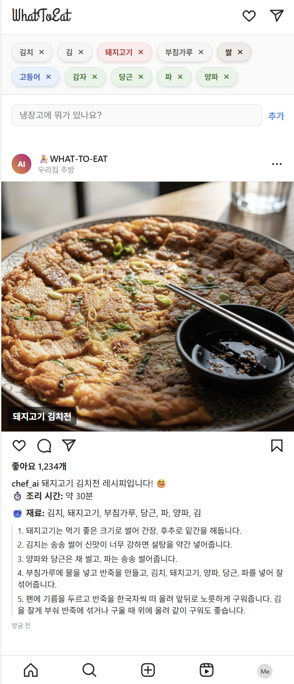

# WHAT-TO-EAT

## 📖 WHAT-TO-EAT 소개

WHAT-TO-EAT은 사용자가 가지고 있는 재료를 기반으로 만들 수 있는 요리를 추천해주는 서비스입니다. Google의 Gemini 모델을 활용하여 최적의 레시피, 조리 시간, 요리 이름을 제안합니다. 
- 

## ✨ 주요 기능

- **재료 기반 요리 추천**: 보유한 재료 목록을 보내면 Gemini 모델이 가장 적합한 요리를 추천합니다.
- **상세 레시피 제공**: 추천된 요리의 조리법을 단계별로 상세하게 안내합니다.
- **예상 소요 시간**: 요리를 완성하는 데 걸리는 예상 시간을 함께 제공하여 효율적인 식사 준비를 돕습니다.

## 🛠️ 사용 기술

- **Language**: JavaScript
- **Framework**: Node.js, Express
- **LLM**: Google Gemini